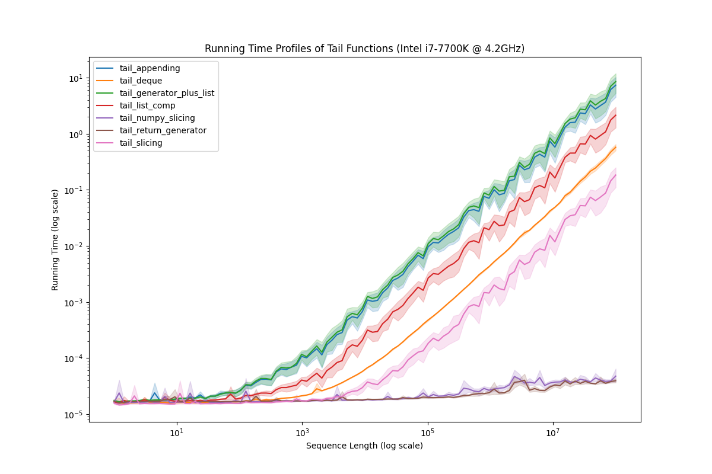

# tail

## Description

This is a repo of my testing and profiling of various implementations of the classic "[tail](https://en.wikipedia.org/wiki/Tail_(Unix))" function, which returns the last `n` elements of a `sequence`. For time profiling, [cProfile](https://docs.python.org/3/library/profile.html) was used. For memory profiling, [memray](https://bloomberg.github.io/memray/index.html) was used. Graphics were genereated with [seaborn](https://seaborn.pydata.org/) and [matplotlib](https://matplotlib.org/) for time and memory profile visualizations, respectively.

Profiling experiment was done as follows for both time and memory usage. We generate a list of `NUM_TRIALS`-many sequence sizes, which grow geometrically up to and including the `MAX_SEQ_SIZE` global parameter. For each sequnce size, the tail implementations are tested on a sequence of 1's of length sequence size on a randomly generated requested index `n`. This trial is done `NUM_ROUNDS` times to get a good distribution on the index. 

To run the script, run the command `python3 main.py time memory`. Omit either time or memory from the command if that profile is not desired.

## Contents

- `global.py`: Global data for changing the experiment size.
- `main.py`: The entry point of this tail profiling program.
- `tail.py`: Contains the implementations of the various functions to be tested.
- `time_prof.py`: Manages the time profiling and the charting of running time data.
- `mem_prof.py`: Manages the memory profiling.
- `time-profile-plot.png`: Plot of the running time data for the various tail implementations.
- `mem-profile-table.png`: Table of the allocation size and quantity of the tail implementations. 

## Results

## Observations

There are a few interesting things to note. First, let's look at the time profile. If a numpy is available to use, it should be the number one priority data structure to use. Second, a generator *might* be the second best option *if* there are few elements you need from it, and they are at the front. This caveat can be seen in that if the generator eventually needs to generate the whole subsequence, it is almost exactly similar to the least efficient method of appending each element needed to a new list. Additionally, the sequence passed into the `tail_return_generator` function should not be changed, since it will corrupt what the generator is returning. Third, if numpy is not a possible option, then returning a slice is your best bet. Another interesting and unexpected alternative was returning a `collections.deque` object. The most interesting feature of this implementation is that the running time is nearly independent of the requested index `n`. This is not a feature of the other implementations.

On the memory data, the generator wrapped around a list was by far the least efficient as it will reallocate the whole list. The deque implementation was the next heaviest in memory, but it was little compared to the generator. Then the list comprehension and appending implementations were negligible. The slicing, both normal and numpy, had allocations too small to be noticed in the data. 
